<div align="center">

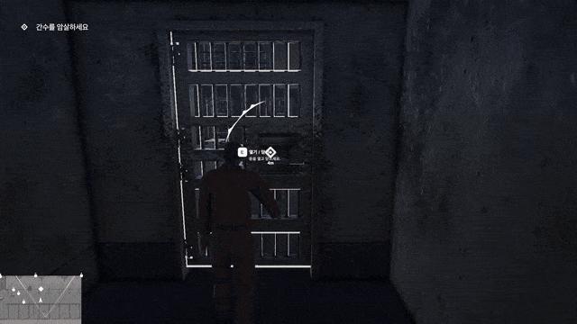

# StealthActionGame_N

**숨어서 접근하고, 들키면 끝나는 3인칭 스텔스 액션**

적의 시야와 소리를 피해 목표를 암살하고 탈출하세요.


[🎮 플레이 영상](#) · [📦 빌드 다운로드](#) · [📑 발표 자료](#)

</div>

---

## 📌 프로젝트 개요

| 항목 | 내용 |
|---|---|
| 장르 | 3인칭 스텔스 액션 |
| 기간 | 2026.09 (2주) |
| 인원 | 4명 — 플레이어 · 레벨 / 적 AI / UI · 사운드 / 에셋 |
| 엔진 | Unity 6 (URP) |
| 주요 기술 | Input System, Cinemachine, NavMesh, FMOD, Animation Rigging |

### 게임 구성

| 🌞 낮 씬 | 🌙 밤 씬 | 🚗 엔딩 |
|:---:|:---:|:---:|
| 정찰과 잠입 | 2개 챕터 · 암살 | 차량 탈출 |
| 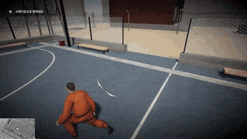 | 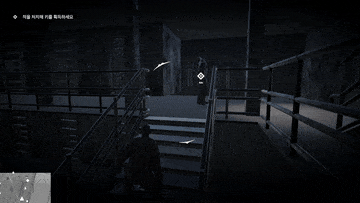 | 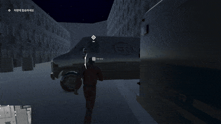 |

---

## 🎮 조작법

| 키 | 동작 |
|:---:|---|
| `W` `A` `S` `D` | 이동 (카메라 기준) |
| `Mouse` | 시점 |
| `Shift` | 달리기 |
| `C` | 앉기 |
| `Space` | 점프 / 벽 넘기 |
| `E` | 상호작용 · 암살 · 시체 들기/놓기 |

---

## 🗺️ 레벨 디자인

### 낮 씬 — 정찰과 잠입 (튜토리얼)

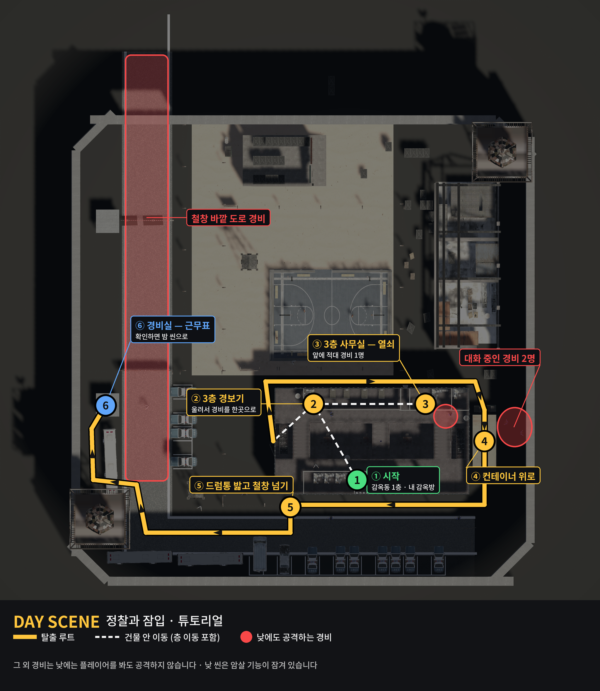

> **설계 의도** — 낮 씬은 암살을 잠가 두고, 조작과 기능을 익히면서 **적과 부딪히지 않고 빠져나가는 감각**을 먼저 기르게 했습니다.

| # | 목표 | 여기서 익히는 것 |
|:---:|---|---|
| ① | 감옥동 1층, 내 감옥방에서 시작 | 이동 · 시점 · 앉기 |
| ② | 3층 경보기를 울려 경비를 한곳으로 모은다 | 상호작용, 경비를 유도하는 발상 |
| ③ | 그 틈에 같은 층 사무실에서 **감옥방 열쇠** 획득 | 아이템 획득 (이 열쇠는 밤 씬까지 이어짐) |
| ④ | 감옥동 왼편으로 나와 건물을 끼고 돌아 **컨테이너 위로** | 벽 넘기 |
| ⑤ | 아래 **드럼통 2개를 밟고 철창을 넘는다** | 발판을 이용한 등반 |
| ⑥ | 주차장 뒤 → 왼쪽 아래 감시탑을 끼고 올라가 **경비실 근무표** 확인 → 밤 씬 | 문서 읽기 |

**경비 규칙**

낮에는 경비가 플레이어를 봐도 공격하지 않습니다. 다만 아래 세 곳은 예외라, 루트가 이들을 비켜 가도록 짰습니다.

- 🔴 3층 사무실 앞 경비
- 🔴 감옥동 오른쪽 컨테이너 옆길에서 대화 중인 경비 2명
- 🔴 도로 안쪽 철창 바깥의 경비들

### 밤 씬 — 암살과 탈출

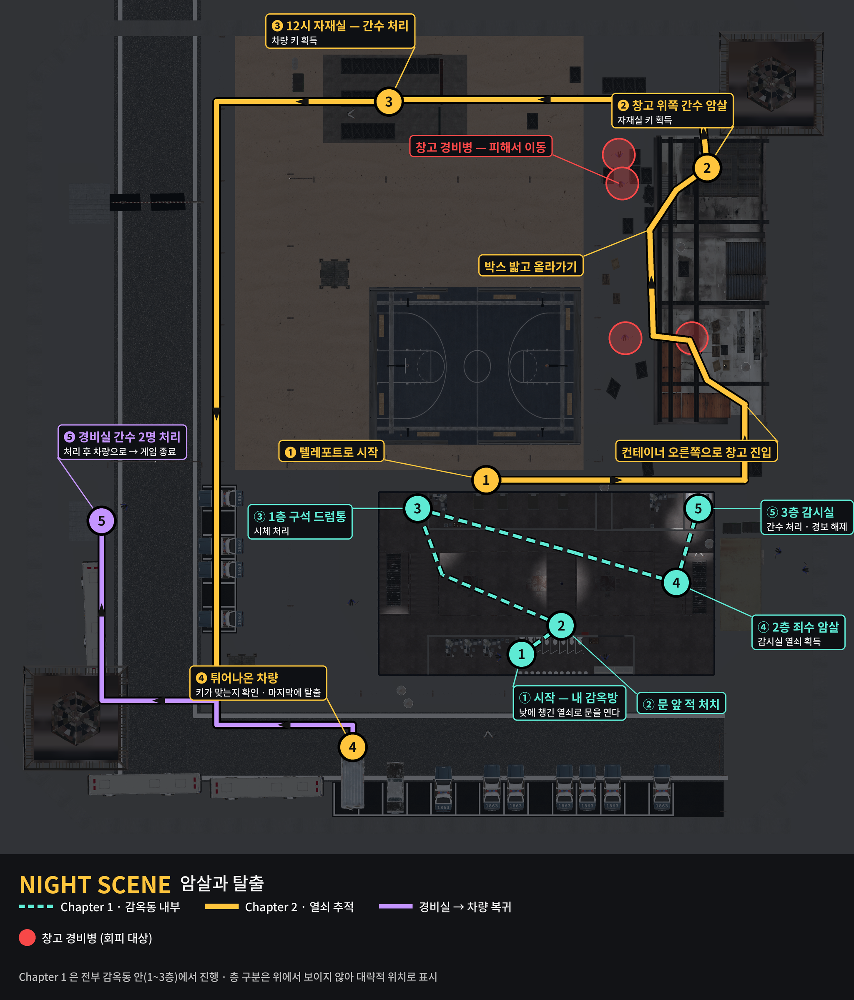

> **설계 의도** — 낮에 익힌 이동·등반·상호작용 위에 **암살과 시체 처리**를 얹습니다. 목표마다 "누가 열쇠를 가지고 있는가"를 따라가게 해서, 암살이 곧 진행 수단이 되도록 짰습니다.

**Chapter 1 — 감옥동 안에서**

| # | 목표 | 쓰이는 시스템 |
|:---:|---|---|
| ① | 낮에 챙긴 열쇠로 내 감옥방 문을 연다 | 씬을 넘어 유지된 열쇠 |
| ② | 문 바로 앞의 적 처치 | 암살 |
| ③ | 1층 구석 드럼통에 시체 처리 | 시체 운반 · 드럼통 |
| ④ | 2층에서 **감시실 열쇠를 가진 죄수** 암살 후 열쇠 획득 | 암살 · 아이템 획득 |
| ⑤ | 3층 감시실에서 간수 처리 후 **경보 해제** → Chapter 1 종료 | 암살 · 상호작용 |

**Chapter 2 — 열쇠를 따라 차량까지**

| # | 목표 | 쓰이는 시스템 |
|:---:|---|---|
| ❶ | 감옥동과 농구장 사이 길목으로 페이드아웃 후 텔레포트 | 씬 내 챕터 전환 |
| ❷ | 창고 아래 누운 컨테이너 오른쪽으로 들어가, 세운 컨테이너 위에서 왼쪽으로 빠져나와 **박스를 밟고** 창고 위쪽으로 → 간수 암살 → **자재실 키** | 은신 · 등반 · 암살 |
| ❸ | 12시 방향 자재실에서 간수 처리 → **차량 키** | 암살 · 아이템 획득 |
| ❹ | 맨 아래 튀어나온 차량에서 키가 맞는지 확인 | 상호작용 |
| ❺ | 낮에 근무표를 봤던 경비실의 간수 2명 처리 후 차량으로 복귀 → **게임 종료** | 암살 · 엔딩 |

> 낮 씬의 경비실을 밤 씬의 마지막 목표로 다시 쓰고, 낮에 얻은 열쇠로 밤을 시작하게 해서 두 씬이 한 공간의 이야기로 이어지게 했습니다.

---

## 🙋 담당 파트 — 박진호

> **플레이어 전체 · 상호작용 프레임워크 · 레벨 디자인 · 씬 연결 / 엔딩 흐름**

설계 목표는 한 문장입니다.

> ### 기능을 늘리는 일이 기존 코드를 고치는 일이 되지 않게

---

## 🧭 설계 원칙 — 각각이 막으려던 문제

| # | 원칙 | 막으려던 문제 |
|:---:|---|---|
| 1 | **한 스크립트는 한 가지만 책임진다** | 기능이 늘 때마다 같은 파일에 조건이 쌓여, 새 기능이 멀쩡한 기능을 깨뜨림 |
| 2 | **입력은 한 곳에서 읽고 이벤트로 흘린다** | 여러 스크립트가 각자 키를 읽어 한 입력이 두 번 처리됨 |
| 3 | **연출은 공통 실행기가 맡는다** | 연출이 중간에 끊기면 조작이 잠긴 채 남아 재시작 외 복구 불가 |

---

## 🏗️ 구조 — 세 층

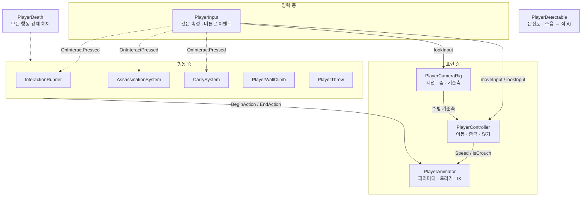

> 실선 = 매 프레임 읽는 값(참조) · 점선 = 일회성 신호(이벤트)

---

## ⚙️ 핵심 시스템

<details open>
<summary><b>1. PlayerInput — 입력의 유일한 창구</b></summary>

<br/>

`E` 키 하나에 문 · 열쇠 · 암살 · 시체 · 문서가 모두 걸립니다. 입력 쪽에서 분기하면 그 함수가 모든 기능을 알게 되므로, **입력은 이벤트만 발행하고 각 시스템이 자기 조건만 검사**합니다.

```csharp
public Vector2 moveInput { get; private set; }
public event Action OnInteractPressed;
```

✅ 발표 직전에 문서 읽기 기능을 추가했지만 이 파일은 **한 줄도 바뀌지 않았습니다.**

</details>

<details>
<summary><b>2. PlayerController — 상태를 갖지 않는 이동</b></summary>

<br/>

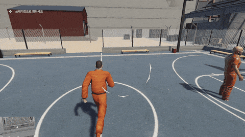

- 속도는 상태가 아니라 **외부가 덮어쓰는 값** — 이동 코드에는 "운반 중"이라는 개념이 없음
- 방향은 카메라가 넘겨준 **수평 축**으로 변환
- 첫 줄 가드로 "꺼진 캡슐에 `Move` 호출" 오류가 번지지 않음

```csharp
if (!_controller.enabled) return;
Vector3 dir = CameraRelative(moveInput);
float speed = _speedOverride ?? baseSpeed;
```

</details>

<details>
<summary><b>3. PlayerCameraRig — 시선의 주인을 하나로</b></summary>

<br/>

- yaw / pitch를 **이 컴포넌트만** 소유, Cinemachine은 따라오기만 함
- 이동 쪽엔 계산된 축만 넘겨 상호 참조 고리를 차단
- 연출 종료 시 `ResetLook()` 한 줄로 복구

✅ 챕터 전환 순간이동 직후에도 항상 캐릭터 정면을 봅니다.

</details>

<details>
<summary><b>4. PlayerAnimator — 판단하지 않는 표현기</b></summary>

<br/>

| 전달 값 | 보내는 쪽 (규칙의 주인) | 표현기가 하는 일 |
|---|---|---|
| `Speed` | PlayerController | 정지 · 걷기 · 달리기 블렌드 |
| `IsCrouch` | PlayerController | 앉기 계층 전환 |
| `BeginAction` / `EndAction` | 실행기 · 암살 · 운반 · 등반 | 행동 진입과 종료 |
| 손 IK 목표 | WallClimb · CarrySystem | 벽 턱과 시체에 손 고정 |

✅ 행동을 5개까지 늘렸지만 기존 모션 전이를 깨뜨린 적이 없습니다.

</details>

<details>
<summary><b>5. 상호작용 프레임워크 — 세 갈래로 나눈 이유</b></summary>

<br/>

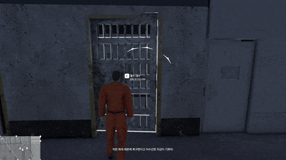

| 역할 | 담당 | 내용 |
|---|---|---|
| `IInteractable` | 대상의 사정 | 지금 가능한가, 무슨 안내를 띄울까 |
| `InteractionAction` | 실제로 하는 일 | 문 열기, 열쇠 사용, 시체 처리, 이미지 표시 |
| `InteractionRunner` | 공통 절차 (한 번만) | 탐색 · 검사 · 잠금 · 정렬 · 애니메이션 · 복구 |

**실행기가 대신하는 여섯 단계**

```csharp
try
{
    SetControlEnabled(false);
    yield return Align(action);
    action.Execute(this);
    yield return Wait(action.rest);
    while (action.isHoldingPlayer)
    {
        yield return null;
    }
}
finally { SetControlEnabled(true); }
```

`finally`가 복구를 보장하므로, 액션에서 예외가 나거나 도중에 사망해도 **조작 불능으로 남지 않습니다.**

**확장 훅 두 개**

| 훅 | 요구사항 | 결과 |
|---|---|---|
| `isHoldingPlayer` | "종이를 읽으면 이미지를 띄워 달라" | 기존 파일 수정 **0개** |
| `isAllowedWhileCarrying` (기본값 `false`) | "시체를 든 동안엔 내려놓기·드럼통만" | 잊으면 막히는 쪽으로 기울임 |

</details>

<details>
<summary><b>6. AssassinationSystem — 판정과 연출의 분리</b></summary>

<br/>

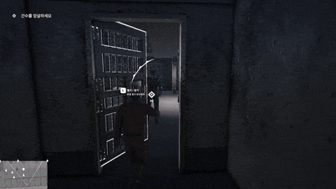

**판정** — 거리 · 등 뒤 각도 · 대상 상태 · 플레이어가 자유로운가
네 번째 조건을 `IsFree()` 한 함수로 모아 **"빠뜨릴 조건" 자체를 제거**했습니다.

**연출** — 잠금 → 등 뒤 정렬 → 양쪽 애니메이션 동시 재생 → 사망 처리 · 기록 이벤트 → `finally` 복구

기록을 이벤트로 흘려서 엔딩 UI가 암살 시스템을 참조하지 않습니다.

</details>

<details>
<summary><b>7. CarrySystem — 시체 운반과 처리</b></summary>

<br/>

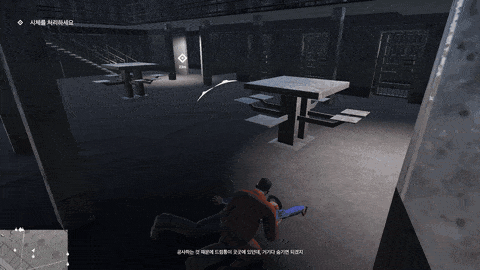

- 래그돌 본 콜라이더를 `GetComponentInParent`로 거슬러 올라가 시체 탐지
- 운반 중 래그돌 전체 kinematic 고정 (움직이는 부모 + 물리 폭발 방지)
- 운반 속도 1.4 m/s — 걷기 클립 루트 이동(1.38 m/s)에 맞춰 발 미끄러짐 제거
- 손 IK로 양손을 시체에 고정

</details>

<details>
<summary><b>8. PlayerWallClimb — 태그 대신 기하 판정</b></summary>

<br/>

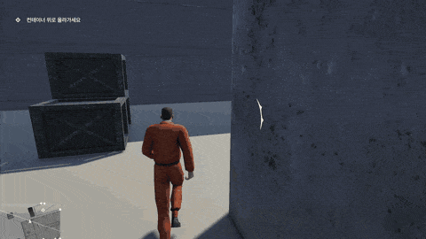

| STEP | 검사 | 목적 |
|:---:|---|---|
| 1 | 앞에 벽이 있나 | 벽면과 법선 획득 |
| 2 | 턱의 높이는 | 올라설 지점 계산 |
| 3 | 설 자리가 있나 | 캡슐 여유 없으면 취소 → 끼임 사전 차단 |
| 4 | 한계 높이 비교 | "발판을 밟아야 넘는 담"이라는 레벨 규칙 |

✅ 레벨을 몇 번을 고쳐도 판정 규칙은 그대로라, 담은 드럼통 높이 기준으로 배치하기만 하면 됐습니다. 레벨 작업 중 등반 코드를 다시 연 적이 없습니다.

</details>

---

## 🔧 트러블슈팅

### CASE 1. 씬을 넘어가면 열쇠가 사라졌다

> 🎬 맨 위 대표 GIF의 첫 장면이 바로 이 결과입니다 — 밤 씬이 시작되자마자 낮에 챙긴 열쇠로 감옥방 문을 엽니다.

| | 코드 | 설명 |
|---|---|---|
| ❌ 원인 | `public KeyInventory pending;` | `DontDestroyOnLoad` 세션은 살아 있었지만, 안에 든 건 **이전 씬 컴포넌트의 참조** |
| ✅ 해결 | `List<string> _pendingKeys;` | 떠날 때 열쇠 **이름 목록**만 남기고 새 씬 인벤토리가 스스로 복원 |

> 💡 씬 경계를 넘는 데이터는 객체가 아니라 **값**이어야 한다.

### CASE 2. 조작 잠금이 엇갈렸다

```
CharacterController.Move called on inactive controller
```

다섯 시스템이 같은 두 스위치(이동 로직, 충돌 캡슐)를 각자 껐다 켜서, 두 연출이 겹치면 서로를 덮어썼습니다.

| 방어선 | 방식 |
|---|---|
| 1차 · 진입 | 모든 시스템이 하나의 "지금 자유로운가" 판정을 공유 |
| 2차 · 복구 | 시스템별 강제 해제 함수 → 사망 시 일괄 호출 |
| 3차 · 방어 | 캡슐이 꺼져 있으면 이동 계산 자체를 건너뜀 |

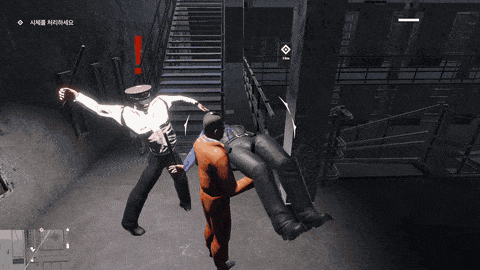

> 💡 여러 시스템이 같은 자원을 만질 때는 **진입 · 복구 · 방어**의 세 겹을 만든다.

---

## 📊 설계 결정 대조표

| 설계 결정 | 막으려던 원인 | 확인된 결과 |
|---|---|---|
| 입력을 이벤트로 공개 | 입력 함수에 기능별 분기 누적 | 기능 추가 시 입력 수정 0건 |
| 이동 컴포넌트는 무상태 | 행동 조합마다 분기 폭발 | 행동 5개에도 분기 증가 없음 |
| 카메라 각도 단일 소유 | 연출 후 시선·줌이 남음 | 워프 직후에도 항상 정면 |
| 공통 실행기 + `finally` | 잠금 해제 누락 → 조작 불능 | 예외·사망에도 조작 복구 |
| 금지의 기본값을 '불가'로 | 예외 규칙을 잊고 새 액션 작성 | 운반 중 오작동 재현 안 됨 |
| 씬 간 전달은 값으로 | 참조가 씬 언로드로 무효화 | 열쇠가 밤 씬까지 유지 |
| 진입 · 복구 · 방어 3겹 | 두 연출이 같은 스위치를 다툼 | 비활성 컨트롤러 오류 소멸 |

---

## 🔁 회고

**반복해서 쓰게 된 패턴**
`이벤트로 흘리기` · `공통 실행기 + 훅` · `상태의 주인 한 명` · `복구 경로 먼저`

**아쉬운 점 → 다음에 할 일**

| 아쉬운 점 | 개선 방향 |
|---|---|
| 조작 잠금이 여전히 불리언 조합 | 단일 상태 기계로 교체, 진입 조건을 그 위에서 판정 |
| 인스펙터 수치가 흩어져 있음 | 데이터 자산(ScriptableObject)으로 분리 |
| 사망·복구 경로를 수동으로만 검증 | 플레이 모드 테스트로 회귀 검출 |

---

## 📁 폴더 구조

```
Assets/
├─ 1.Scene/          씬 (낮 / 밤 / 엔딩)
├─ 3.Script/
│  ├─ Player/        입력 · 이동 · 카메라 · 애니메이터 · 암살 · 운반 · 등반
│  ├─ Interaction/   InteractionAction 및 파생 액션
│  └─ EnemyAI/       상태 머신 · 감지 · 커맨드
├─ 5.Animation/      Animator Controller
└─ 10.Input/         HitMan.inputactions
```

## 👥 팀원

| 이름 | 담당 |
|---|---|
| 박진호 | 플레이어 · 상호작용 프레임워크 · 레벨 디자인 · 씬 연결 / 엔딩 |
| 김종찬 | 적 AI |
| 박지은 | UI / 사운드 |
| 김문규 | 에셋 탐색 |
